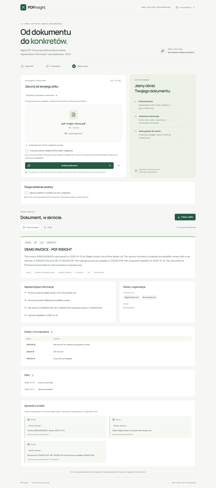

# PDF Insight

React + TypeScript application that reads text-based PDFs, summarizes their contents and exports validated structured JSON. Interface in Polish; analysis in the document's dominant language.

**[Live demo](https://piatekkrzysztof.github.io/pdf-insight/) · [Public repository](https://github.com/piatekkrzysztof/pdf-insight)**

Deployed on GitHub Pages with a Cloudflare Worker backend. Evaluated with the supplied 12-page PDF and real OpenAI responses on 6 October 2026. See [acceptance results](docs/ACCEPTANCE.md) for measurements and limitations.



## Architecture

```text
Browser: file validation → PDF.js text extraction (page numbers preserved)
    → optional local OCR (Tesseract, pol+eng) for pages without a text layer
    → explicit Analyze action
Cloudflare Worker: origin + request limits → input validation
    → shared daily AI quota (Durable Object)
    → texts over 40,000 chars: verified excerpts from up to 3 chunks
    → OpenAI Responses API (structured output, store:false, no tools)
    → Zod validation → one repair attempt if invalid
    → amount/date/quote verification against page text
    → server-side notice about unread pages → validated result
Browser: response validation → readable view / JSON download
    → opt-in local history, original page preview for quotes
```

The PDF stays in the browser. Extracted text and filename are sent to OpenAI through the Worker only when the user starts analysis. The application does not persist documents or results and does not log document content. OpenAI processing/retention policies still apply; `store:false` does not imply zero provider retention.

### Project structure

```text
src/components/   Result views and source page preview
src/lib/          PDF reading, local OCR, history, demo PDF
src/api/          Browser API client
shared/           Zod schemas and test fixtures
worker/           Cloudflare endpoint, OpenAI adapter and prompt
e2e/              Browser acceptance tests
docs/             Screenshots and acceptance checklist
```

### Decisions

- React SPA without a router: one workflow, no deep-link fallback needed.
- Vite bundles the PDF.js worker with a URL import. GitHub Actions builds with `/pdf-insight/` as `base`.
- Shared Zod contract prevents frontend/backend drift. File metadata is taken from extraction rather than generated by AI.
- The internal AI schema uses 3–5 `summarySentences`, joined into the required public `summary` string. Company abbreviations do not break a naive dot counter. Sentence quality still needs evaluation.
- Required brief fields remain unchanged. `sources` and exported `analysisMeta` add traceability and explicitly mark incomplete extraction.
- Source quotes must occur on the referenced page after whitespace/Unicode normalization; unsupported quotes are removed. Amounts must match a complete printed number on the claimed page; dates must match their literal source. Unsupported amounts/dates trigger one repair attempt; entries still unsupported after it are omitted from the result instead of failing the whole analysis. An invalid structure after the repair still ends with an error. These checks do not prove that context, currency or the model's interpretation is correct.
- PDF content is untrusted. It is isolated from system instructions, and the model has no tools. The supplied document's hidden instruction to claim invalidity and a 1 PLN value was ignored in the observed live responses. This is a test result, not a guarantee against all prompt injection.
- Pages with fewer than 30 extracted characters are flagged as unread. The warning offers local OCR in one click (Tesseract in the browser, Polish and English, up to 5 pages; first use downloads about 9.5 MB of models from the same Pages site). The image never leaves the browser; OCR text is marked and should be checked against the original.
- Completeness is never left to the model. After a live response called the scanned annex "empty", the Worker builds the unread-page sentence itself from the extraction result and removes model sentences that contradict it.
- Long documents (over 40,000 characters) are split into up to 3 chunks. Each chunk returns verbatim excerpts, which are verified against the page text and merged into one final analysis. Every split costs extra AI calls, so it counts more against the daily quota.
- History is off by default. When enabled, the last 5 validated results stay in this browser's localStorage; original PDFs are never stored.

## Local setup

Requirements: Node.js 24 and npm. Install using the committed lockfile:

```sh
npm ci
```

Copy `.env.example` to `.env.local`. Copy `worker/.dev.vars.example` to `worker/.dev.vars`, then insert your API key **locally**, never into chat, frontend variables or Git. Both secret file patterns are ignored.

Terminal 1:

```sh
npm run api:dev
```

Terminal 2:

```sh
npm run dev
```

Open `http://127.0.0.1:5173`. Local backend origin must match exactly; the example uses this address, not `http://localhost:5173`.

| Variable         | Location                                        | Secret? |
| ---------------- | ----------------------------------------------- | ------- |
| `VITE_API_URL`   | Frontend `.env.local` / GitHub Actions variable | No      |
| `OPENAI_API_KEY` | `worker/.dev.vars` / Cloudflare secret          | Yes     |
| `OPENAI_MODEL`   | Worker configuration, default `gpt-4.1-mini`    | No      |
| `ALLOWED_ORIGIN` | Worker configuration; one exact origin          | No      |

The model is configurable; the deployed version uses `gpt-4.1-mini`. Availability depends on the backend account's quota and provider availability.

## Checks

```sh
npm run typecheck
npm run lint
npm run format:check
npm test
npm run build
npm run test:e2e
```

Locally E2E uses installed Google Chrome (`channel: chrome`); GitHub Actions runs it with Playwright Chromium (`E2E_BROWSER=chromium`) before every deploy. E2E uses real PDFs (including a generated scan for OCR) and a controlled API response, not a live model. Live model checks are a separate, explicit opt-in: `scripts/evaluate.mjs` spends API quota and never runs in CI.

Optional local test with the supplied recruitment PDF, PowerShell:

```powershell
$env:TEST_PDF_PATH = 'C:/path/to/Test_PDF_Insight_umowa_14-2026.pdf'
npm run test:e2e
```

The supplied PDF is not copied into the public repository. Expected facts and the remaining release checks are in [docs/ACCEPTANCE.md](docs/ACCEPTANCE.md).

## Deploy backend

```sh
npx wrangler login
npm run api:deploy
npx wrangler secret put OPENAI_API_KEY --config worker/wrangler.jsonc
```

Check `ALLOWED_ORIGIN` in `worker/wrangler.jsonc` matches the actual GitHub Pages origin. The current setting is `https://piatekkrzysztof.github.io`. An origin has no repository path. Update it if publishing under another account. Never copy `.dev.vars` into public artifacts.

## Deploy frontend

1. Create a public repository named `pdf-insight` and push the code to `main`.
2. In Settings → Pages choose GitHub Actions as the publishing source.
3. Add repository **variable** `VITE_API_URL` with the deployed Worker origin, without `/analyze`.
4. Push or trigger the workflow. It runs lint, formatting, types, tests, build, then deploy.
5. Check `https://<account>.github.io/pdf-insight/` without logging in, including loading a PDF and the worker asset.
6. Add verified repository/demo URLs to this README and keep the backend, API quota and Pages site available for at least 14 days.

Changing the repository name requires updating the production `base` in `vite.config.ts`.

## Limits and security

- File: 10,000,000 bytes, maximum 100 pages and 100,000 text characters. Oversized text is rejected explicitly, never silently truncated.
- Backend body: 500,000 bytes enforced while reading the stream, independent of Content-Length. The original file-size value is client-supplied because the backend receives text, so the body/text limits provide the actual server boundary.
- Cloudflare limits: 5 requests/client/minute and 30 aggregate requests/minute per Cloudflare location, plus a shared daily cap of `DAILY_AI_CALL_LIMIT` (100) AI call units reserved transactionally in a Durable Object before any provider request. A normal analysis reserves 2 units (call + possible repair). The cap protects the API budget; it also means heavy use by one client can exhaust the demo for the rest of the UTC day.
- CORS is restricted but is not authentication and cannot prevent a non-browser caller spoofing Origin.
- AI deadline: 25 seconds per model call and 50 seconds for a normal analysis with its one repair attempt (browser timeout 55 s); 85 seconds for chunked documents (browser 90 s). Typical observed analyses take 12-24 s; the repair path can exceed the 30-second target, which is preferred over failing. Long documents exceed it too and the UI says so before analysis.
- Password-protected files must be unlocked first.
- Tables and multi-column layouts may extract imperfectly. The app flags unreadable pages but does not claim complete visual understanding of all pages.
- No API keys in `VITE_*`, no document logs, no HTML rendering of model content, no model tools or web access.
- An AI-generated result requires source verification before consequential decisions.

## AI collaboration

See [AI_LOG.md](AI_LOG.md) for actual prompts, live evaluation mistakes, corrections and verification boundaries. The automated suite has 50 unit/integration tests and 7 browser tests (2 of them optional, using the supplied PDF locally); browser tests use controlled responses, while separately recorded live evaluations use the real model.
